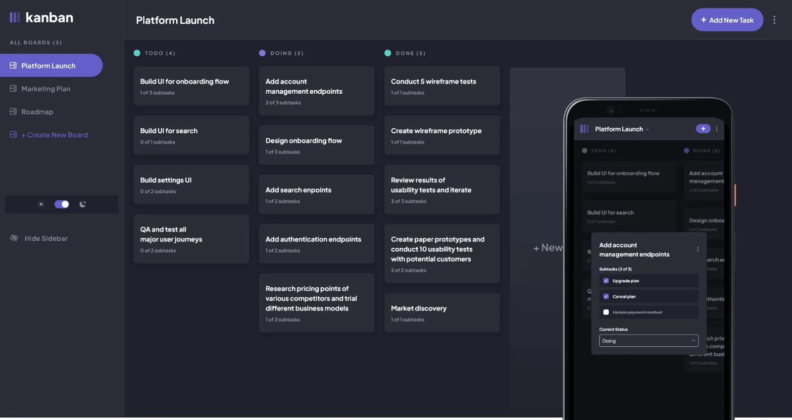

# Kanban task management app

## Overview

Convenient and handy web app for managing your tasks and workflow. It has a sleek design and eye-appealing animation effects. It uses local storage to store the task content in the browser memory.

### Screenshot

### Links

[Link to the app](https://kanban-react-delta.vercel.app/)

## My process

### Built with

- Semantic HTML5 markup
- TypeScript
- Tailwind CSS
- React
- Mobile-first workflow

## Author

- Website - [My web portfolio](https://bespokewebsites.pro/)